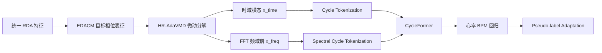

# 方法流程：CycleFormer 周期 Token 雷达心率估计

## 研究主线

本项目当前主线聚焦毫米波雷达跨数据集心率估计。核心假设是：雷达生命体征信号不是普通时间序列，而是由呼吸、心跳、谐波和噪声共同构成的多周期微动过程。因此主模型不再以 HeartTimeMixer 为中心，而采用 **CycleFormer**：按候选生理周期构造 token，再用 Transformer 建模周期内形态和周期间稳定性。

## 模块边界

### 1. RDA 统一输入

输入来自 `exports/{DATASET}/samples/*.npz`，核心字段为 `radar`、`time`、`heart_rate`、`respiration_rate`。雷达统一为 complex RDA 语义，通常为 `(frames, doppler, angle, range)`。

### 2. EDACM 目标相位表征

代码：`src/features/edacm.py`。

该模块负责目标 bin 选择和相位构建。它根据空间能量、相位稳定性、心率频带谱峰和空间一致性选择多个生命体征稳定 bin，然后提取 EDACM 相位并融合为微动信号。

### 3. HR-AdaVMD 微动分解

代码：`src/features/hr_adavmd.py`。

该模块使用生理频带先验初始化 VMD 中心频率，按心率频带能量、谱峰锐度、呼吸泄漏和高频噪声计算模态评分，再对模态做自适应加权。默认输出 `K=7` 个模态。

### 4. 时频特征组装

代码：`src/features/representations.py`。

默认表征为 `proposed`：

- `x_time`：HR-AdaVMD 后的时域模态，默认形状 `(7, 256)`。
- `x_freq`：对 `x_time` 做 Hann-RFFT-log magnitude 得到的频域特征，默认形状 `(7, 129)`。
- `freq_hz`：频率坐标，用于 FFT/STFT 传统 baseline。

### 5. CycleFormer 主模型

代码：`src/models/cycleformer.py`。

当前实验采用的改进版 CycleFormer 采用“局部微动主预测 + 周期 token 残差修正”结构。设计目标是显式适配生命体征周期结构，同时保留 TCN 对局部波形的强建模能力：

1. **候选生理周期 tokenization**：根据 20 Hz 默认采样率设置心跳候选周期和呼吸候选周期，例如 8-30 samples 对应常见心率范围，40-128 samples 对应常见呼吸范围。
2. **周期内编码**：将窗口按候选周期折叠为多个 cycle，使用 1D convolution 编码单周期形态。
3. **周期间聚合**：对同一候选周期下的多个 cycle 做聚合，减少幅值和局部噪声影响。
4. **周期 token Transformer**：将不同候选周期 token 输入 Transformer，学习心跳、呼吸及谐波之间的关系。
5. **局部 TCN 分支**：分别对 `x_time` 和 `x_freq` 建模局部微动形态，形成主预测。
6. **周期残差修正**：周期 token 分支只输出 residual correction，通过可学习门控叠加到局部主预测，降低周期分支过拟合或干扰主预测的风险。
7. **时频双分支融合**：分别对 `x_time` 和 `x_freq` 构造局部特征与周期特征，再融合输出窗口级心率。

该设计的论文叙事是：相比固定 patch 或普通时间步 token，周期 token 更贴合 HR/RR 的生理生成机制，也更有利于跨设备、跨场景泛化。

### 6. 对比模型

代码：`src/models/` 和 `src/training/evaluate_signal_baselines.py`。

保留的代表性对比方法为：

- `FFT`：传统频域峰值法。
- `STFT`：短时频谱 ridge/峰值跟踪。
- `TCN`：卷积时序 baseline。
- `Transformer`：普通 attention 时序 baseline。
- `PatchTST`：patch-based Transformer 先进时序 baseline。
- `TimesNet`：周期 2D 变化建模先进时序 baseline。
- `Source Only`：源域有标签训练后直接测试目标域。
- `Pseudo-label Adaptation`：目标域无标签伪标签适配。

`HeartTimeMixer` 代码保留，用于兼容旧实验，但不再作为当前方法主线。

### 7. Pseudo-label Adaptation

代码：`src/training/adapt_source_free.py`。

源模型先在目标域无标签窗口上预测伪标签；再按 `group_key` 与 `window_start` 排序，对预测序列做移动平均时序修正；最后根据原始预测与修正值的残差生成置信度权重，用加权伪标签损失适配目标域。

## 代码入口

- 数据统一导出：`src/data/loaders/export_all_datasets.py`
- 训练窗口构建：`src/data/build_training_dataset.py`
- 主特征表征：`src/features/representations.py`
- CycleFormer 主模型：`src/models/cycleformer.py`
- 监督训练：`src/training/train_model.py`
- 深度模型评估：`src/training/evaluate_model.py`
- FFT/STFT 评估：`src/training/evaluate_signal_baselines.py`
- 源无关适配：`src/training/adapt_source_free.py`
